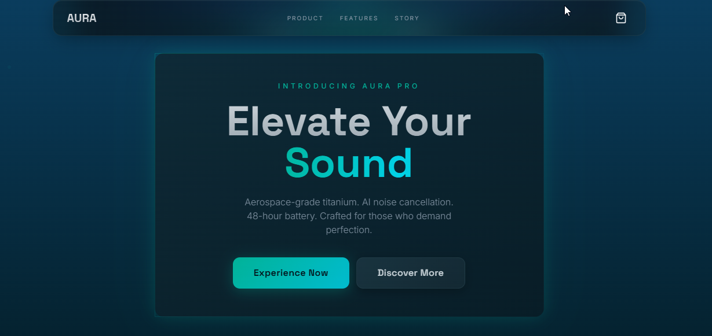
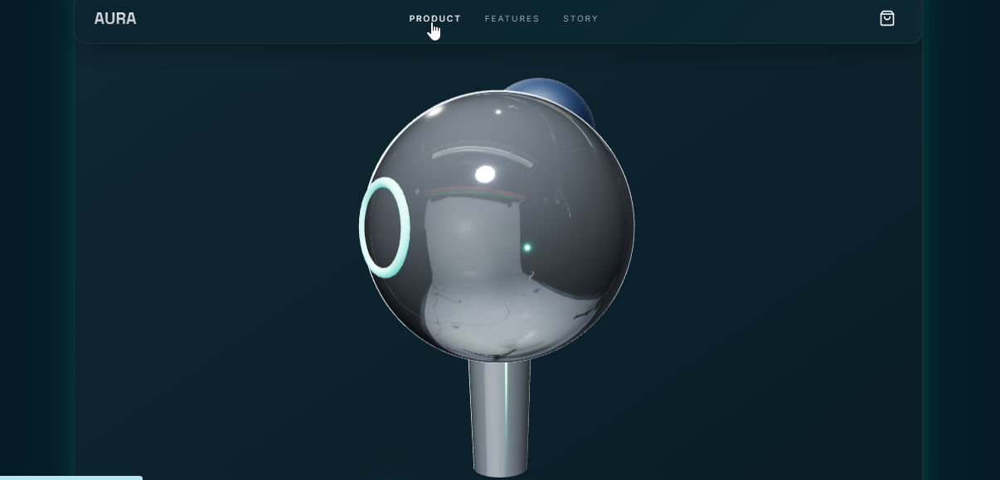

# 🎧 Lumina Sound

> **Premium earbuds product landing page** built with modern frontend technologies, delivering a high-end UI/UX experience with interactive features and scalable architecture.

---

## 🚀 Live Demo

👉 https://lumina-sound-six.vercel.app/

---

## 📸 Preview





---

## 💡 About This Project

Lumina Sound is a **premium frontend project** designed to replicate real-world product experiences similar to high-end brands.
It focuses on **modern UI/UX principles, performance optimization, and component-based scalability**.

This project demonstrates the ability to build **interactive, visually rich, and production-ready frontend applications**.

---

## ✨ Key Features

* 🎨 **Modern & Responsive UI** — Optimized for all devices
* 🛒 **Interactive Cart System** — Dynamic product handling
* 🎧 **Product Customization** — Flexible user experience
* 🔍 **Product Comparison & Specs** — Detailed insights
* 🔊 **Audio Demo Experience** — Engaging feature simulation
* 🧩 **Reusable Components** — Scalable architecture
* ⚡ **High Performance** — Powered by Vite

---

## 🛠️ Tech Stack

| Category      | Technology         |
| ------------- | ------------------ |
| Frontend      | React + TypeScript |
| Build Tool    | Vite               |
| Styling       | Tailwind CSS       |
| UI Components | shadcn/ui          |
| Testing       | Vitest             |

---

## 📁 Project Structure

```
src/
 ├── components/      # Reusable UI components
 ├── pages/           # Application pages
 ├── hooks/           # Custom React hooks
 ├── lib/             # Utility functions
 ├── App.tsx          # Root component
 └── main.tsx         # Entry point
```

---

## ⚙️ Installation & Setup

```bash
git clone https://github.com/MdSajjadUllah/lumina-sound.git
cd lumina-sound
npm install
npm run dev
```

---

## 🧪 Testing

```bash
npm run test
```

---

## 🚀 Deployment

This project is deployed using modern hosting platforms:

* **Vercel** (Recommended)
* **Netlify**

---

## 📌 Future Enhancements

* 🔗 Backend Integration (Django / Node.js)
* 💾 Persistent Cart with Database
* 🔐 Authentication System
* 💳 Payment Gateway Integration
* 📦 Order Management System

---

## 🤝 Contributing

Contributions, issues, and feature requests are welcome!
Feel free to fork this repository and submit a pull request.

---

## 📄 License

This project is licensed under the **MIT License**.

---

## 👨‍💻 Author

**Md.Sajjad Ullah**

* GitHub: https://github.com/MdSajjadUllah

---

## ⭐ Support

If you found this project helpful or inspiring, consider giving it a ⭐ on GitHub — it helps a lot!
